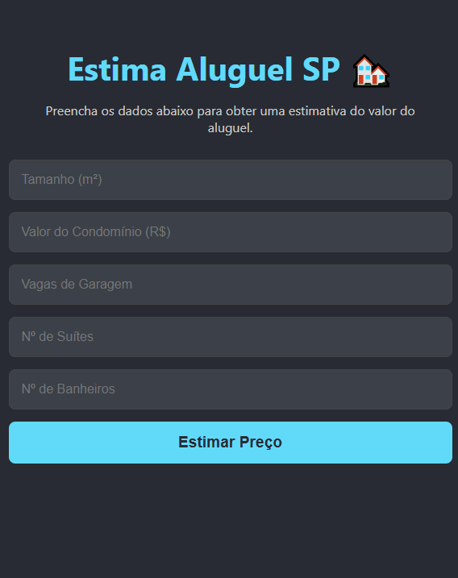

# AlugaSP - Estimador de Aluguel com IA 🏘️




---

## 📜 Sobre o Projeto

**AlugaSP** é uma aplicação web fullstack que utiliza um modelo de Machine Learning para prever o valor do aluguel de imóveis na cidade de São Paulo. O projeto integra um frontend interativo em React com uma API de backend em Python (Flask) que serve as previsões de um modelo de Regressão Linear treinado.

Este projeto demonstra a conexão de ponta a ponta entre a Ciência de Dados e o Desenvolvimento Web, desde o treinamento de um modelo até sua implantação e consumo em uma aplicação real.

---

## 🛠️ Stack de Tecnologias

- **Frontend:**
  - React.js
  - CSS
- **Backend:**
  - Python
  - Flask (para a API)
  - Scikit-learn, Pandas, Joblib (para o modelo de ML)
- **Infraestrutura & Ferramentas:**
  - VS Code
  - Git & GitHub
  - Thunder Client (para testes de API)

---

## 🚀 Como Executar o Projeto Localmente

Para rodar este projeto, você precisará ter o Python e o Node.js instalados em sua máquina.

**Primeiro, clone o repositório e entre na pasta:**
```bash
# 1. Clone o repositório
git clone [https://github.com/nathanmoreeira/aluga-sp.git](https://github.com/nathanmoreeira/aluga-sp.git)

# 2. Navegue até a pasta do projeto
cd aluga-sp
```
## Em seguida, configure o Backend (API em Flask):
(Execute os comandos abaixo em um terminal, dentro da pasta aluga-sp)
```bash
# 3. Crie e ative um ambiente virtual
python -m venv venv
# No Windows:
.\venv\Scripts\activate
# No Mac/Linux:
source venv/bin/activate

# 4. Instale as dependências
pip install Flask Flask-Cors scikit-learn pandas joblib

# 5. Inicie o servidor da API (ele rodará em http://localhost:5000)
python app.py
```
## Por último, configure o Frontend (Interface em React):
(Abra um novo terminal, também na pasta aluga-sp, e execute os comandos abaixo)
```bash
# 6. Navegue até a pasta do frontend
cd frontend

# 7. Instale as dependências
npm install

# 8. Inicie a aplicação (ela rodará em http://localhost:3000)
npm start
